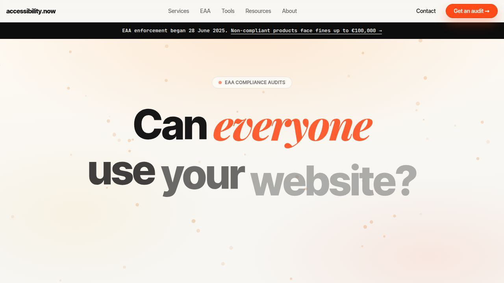

# accessibility.now



**B2B digital accessibility agency website**: helping European enterprises achieve EAA compliance before the June 2025 deadline.

**accessibility.now** is the A11y agency product: live URL audit, monitoring, and WCAG tooling in one place.

---

## Features

- **Live accessibility audit**: paste any URL, get a WCAG 2.1 AA score, violation list, and PDF report in seconds (Playwright + axe-core). `POST /api/audit` accepts optional `profile: strict` (adds AAA-oriented axe tags) and `multiViewport: true` (mobile + desktop merge); responses can include `scanMetadata` (viewports used, optional console / failed-request hints).
- **Website scanner (tools)**: `/tools/website-scanner` runs the same engine with those options; audit result links into focus order, screen reader preview, colour blindness, and low-vision tools with `?url=…`.
- **Continuous monitoring**: register a URL for weekly/monthly re-scans; receive email summaries when scores change
- **Contrast Checker**: real-time WCAG AA/AAA pass/fail with live text preview
- **Focus Order Visualiser**: tab-order overlay on any URL, rendered in-browser
- **Screen Reader Preview**: ARIA tree and reading-order render for any page
- **WCAG 2.1/2.2 Developer Guide**: POUR principles, 24 AA criteria tables, implementation notes
- **EAA Compliance Checklist**: 42-item interactive checklist with localStorage persistence and PDF export
- **Blog**: EAA enforcement timeline, e-commerce WCAG failures, automated vs manual testing
- **Pricing**: Free audit / €3,500 full audit / €890/mo monitoring, FAQ accordion

---

## Tech stack

| Layer | Technology |
|---|---|
| Frontend | React 19, Vite 7, Tailwind CSS v4, GSAP 3 + ScrollTrigger |
| API | Express 5, TypeScript |
| Database | PostgreSQL + Drizzle ORM |
| Scan engine | Playwright + Chromium + axe-core (JSDOM fallback) |
| Codegen | Orval (OpenAPI → TanStack Query + Zod) |
| Monorepo | pnpm workspaces |
| Email | nodemailer (no-op when SMTP vars absent) |
| Charts | Recharts |

---

## Local setup

### Prerequisites
- Node.js 20+
- pnpm 9+
- PostgreSQL (local install, Docker, or a managed host)

### 1. Clone
```bash
git clone https://github.com/your-org/accessibility-now.git
cd accessibility-now
```

### 2. Install dependencies

One command from the repo root installs every workspace package (see `pnpm-workspace.yaml`).

```bash
pnpm install
```

### 3. Configure environment
```bash
cp .env.example .env
# Edit .env: at minimum set DATABASE_URL
```

### 4. Set up the database
```bash
pnpm --filter @workspace/db run migrate
```
Requires `DATABASE_URL` in `.env`. For the bundled Docker dev database, `pnpm db:up` starts Postgres and applies migrations (including `scan_metadata` / `0003_scan_metadata` when present).

### 5. Install Playwright browser
```bash
pnpm --filter @workspace/api-server exec playwright install chromium
```

### 6. Start the dev servers
```bash
# In terminal 1: API server (port 8080)
pnpm --filter @workspace/api-server run dev

# In terminal 2: Frontend (optional $PORT, default 5180)
pnpm --filter @workspace/accessibility-now run dev
```

Open `http://localhost:5180` in your browser.

---

## Environment variables

See `.env.example` for the full list with comments.

| Variable | Required | Purpose |
|---|---|---|
| `DATABASE_URL` | Yes | PostgreSQL connection string |
| `PORT` | No | API server port (default 8080) |
| `SMTP_HOST` | No* | SMTP server hostname |
| `SMTP_PORT` | No* | SMTP port (587 or 465) |
| `SMTP_USER` | No* | SMTP username |
| `SMTP_PASS` | No* | SMTP password |
| `FROM_EMAIL` | No* | Sender address for system emails |
| `GITHUB_TOKEN` | No | GitHub PAT for post-merge sync |
| `GITHUB_REPO` | No | GitHub repo HTTPS URL |
| `SCAN_MAX_CONCURRENT` | No | Max simultaneous Playwright scans (default 2, max 4) |
| `SCAN_TIMEOUT_MS` | No | Base scan budget in ms (default 45000) |
| `SHUTDOWN_DRAIN_MS` | No | Graceful shutdown wait for in-flight scans (default 120000) |

*All five SMTP vars must be set together for email delivery. If any are absent, emails are logged but not sent.

**Production checklist:** after deploy, confirm `GET /api/healthz` returns `"scanEngineReady": true`. If false, run `pnpm --filter @workspace/api-server exec playwright install chromium` on the API host.

---

## Project structure

```
.
├── artifacts/
│   ├── accessibility-now/    # React + Vite frontend
│   └── api-server/           # Express 5 REST API
├── lib/
│   ├── api-spec/             # OpenAPI YAML spec
│   ├── api-client-react/     # Generated TanStack Query hooks
│   ├── api-zod/              # Generated Zod request/response schemas
│   └── db/                   # Drizzle schema, migrations, db client
├── docs/                     # Developer and ops documentation
│   ├── development.md        # Day-to-day dev workflows, API/DB/scan notes
│   ├── design.md             # Brand tokens, component conventions, GSAP patterns
│   ├── roadmap.md            # Feature status and backlog
│   ├── memory.md             # Architecture decisions and gotchas
│   ├── admin.md              # Ops runbook: DB queries, migrations, secrets
│   └── screenshot-capture.md # Playwright full-page / strip capture + Cursor Browser MCP
├── scripts/
│   └── post-merge.sh         # Post-merge: install, migrate, GitHub sync
└── .env.example              # Environment variable template
```

---

## Key commands

```bash
pnpm install                                    # All workspace packages (run at repo root)
pnpm run typecheck                              # Full typecheck across all packages
pnpm run build                                 # Typecheck + build all
pnpm --filter @workspace/api-spec run codegen  # Regenerate API hooks + Zod schemas
pnpm --filter @workspace/db run generate       # Generate new Drizzle migration
pnpm --filter @workspace/db run migrate        # Apply pending migrations
pnpm --filter @workspace/db run push           # Push schema directly (dev only)
```

---

## Contributing

1. Create a branch from `main`
2. Make your changes; run `pnpm run typecheck` before committing
3. Open a pull request: CI will run type checks
4. After merge, `post-merge.sh` automatically installs deps, runs migrations, and syncs to GitHub

---

## Documentation

- [Developer guide](docs/development.md): monorepo workflows, API contract changes, DB migrations, scan stack, tests
- [Design system](docs/design.md): colours, typography, GSAP patterns
- [Roadmap](docs/roadmap.md): launched features, backlog, Q2/Q3 priorities
- [Architecture decisions](docs/memory.md): why decisions were made, gotchas
- [Ops runbook](docs/admin.md): DB queries, migrations, SMTP setup, deployment
- [Screenshot capture](docs/screenshot-capture.md): Playwright strip fallback, layout stability, Cursor Browser MCP limits

---

## Licence

Private. accessibility.now. All rights reserved.
